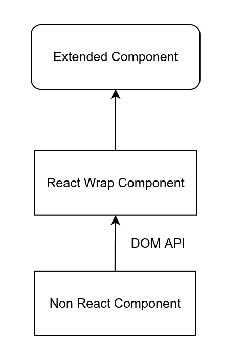

# 一个概念验证：如何允许一个支持扩展的 React SDK 运行在 非 React 项目上

## 源由

在项目中，我们遇到到了需要将一个 React SDK 跑在主流前端框架上的诉求，我们的 SDK 架构类似下面，是一个低代码 SDK 架构，允许用户通过自定义 React 组件扩展功能。


可见，我们需要解决两个问题：

1. UI Component 部分如何跑在非 React 项目里： 简单，用 ReactDOM 在指定 DOM 上渲染就行了
2. Extended Component 扩展部分怎么跑在非 React 项目里：逻辑上的解决方案也简单，对与非 React 组件，我们把他封装一下，变成一个 Extended React Component 就行了，难的部分在怎么封，具体请参考本 POC 的代码。



## 运行

```sh
npm install
npm run bootstrap

# Angular demo
npm run angular:dmeo

# Vue demo
npm run vue:dmeo
```

