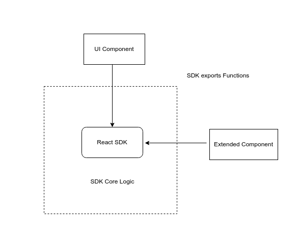
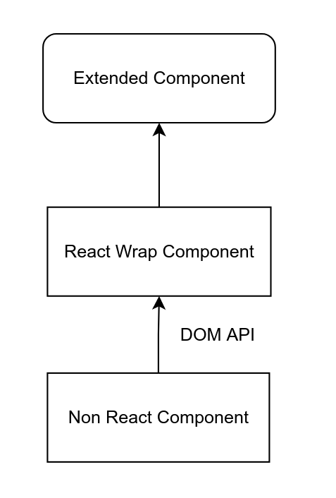

# A Proof of Concept Repo for Multi Front-end Framework base a core extensiable SDK

[Chinese Version](./README.cn.md)

## Why

In our Project, we have a core SDK build with React which is a front low code page render. We need use the SDK support Mainstream front-end framework. 

The SDK architecture likes below.



You can see. If we want make the React based SDK can run in non-react projct. We have two challenges.

1. Make UI Component run in non-react project: Simple, using React DOM mount in sepecific DOM is ok.
2. Make Extended Component run in non-react projct: Logic is Simple, just wrap non-react Component as a Extended React Component. The harder part is how to wrap. Detail is in this POC projct code.



## Installation

```sh
npm install
npm run bootstrap

# Angular demo
npm run angular:dmeo

# Vue demo 
npm run vue:demo
```

