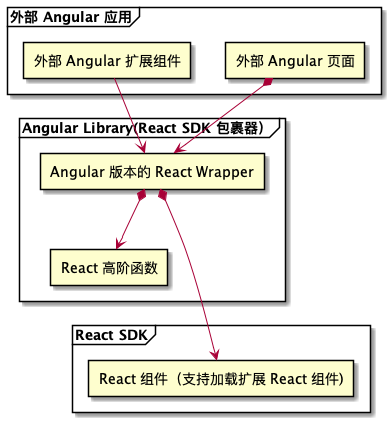

## MonoRepo for Vue/Angular Version wrap React library

The React Library is core library, And it can render the component which has {control, onChange} structure props pass as props to React Component.

The Angular/Vue Library use ReactDom Renderer to render React Core Component, and use Angular/vue Component Resolver to wrap ExtComponet which is write as Angular/Vue code.

## Installation

```sh
yarn install
yarn bootstrap

// or maybe
yarn ng:lib:build
yarn vue:lib:build
```

## Mechainsm

The mechanism diagram of the Solution


